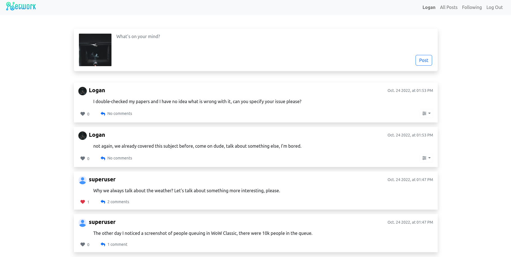
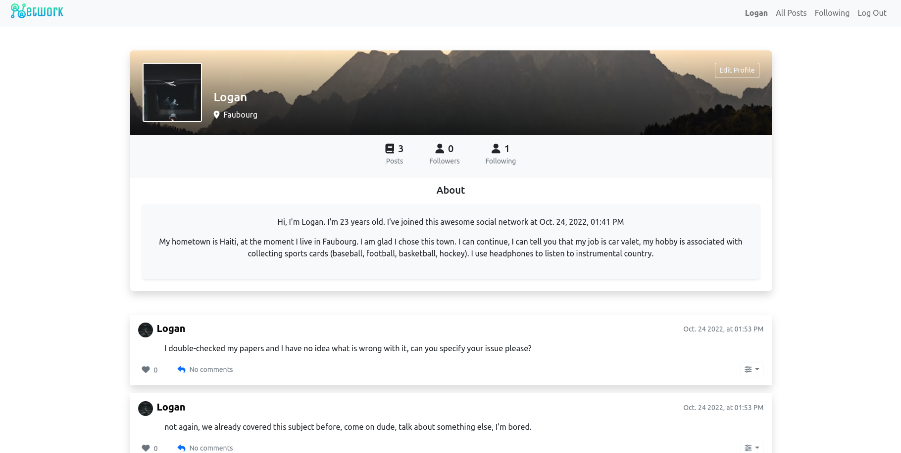
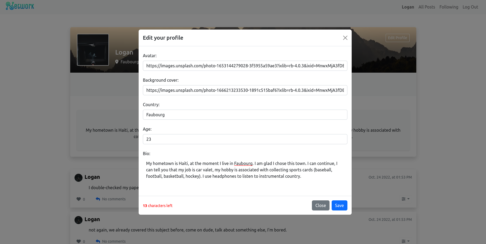
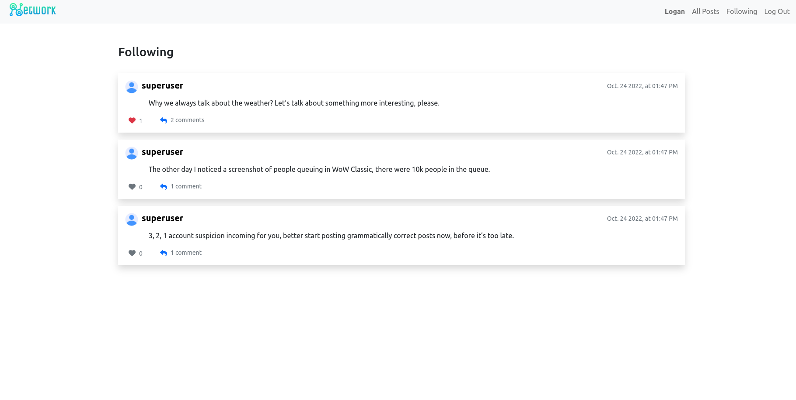
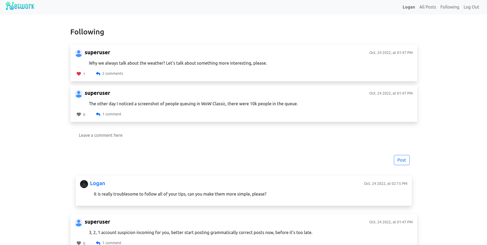
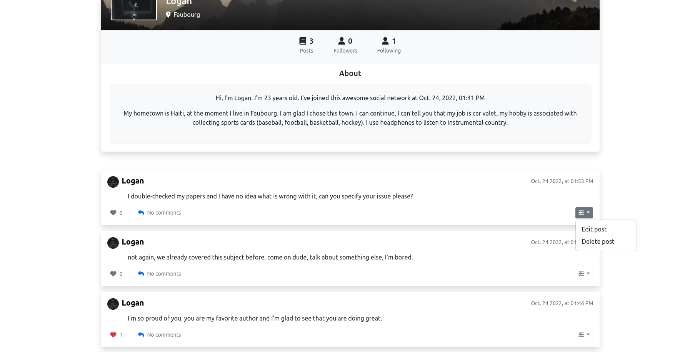

<div align="center" id="top"> 
  
  <h1>Network</h1>
&#xa0;

</div>


<p align="center">
      
</p>

<p align="center">
  <a href="#dart-about">About</a> &#xa0; | &#xa0; 
  <a href="#sparkles-features">Features</a> &#xa0; | &#xa0;
  <a href="#rocket-technologies">Technologies</a> &#xa0; | &#xa0;
  <a href="#white_check_mark-requirements">Requirements</a> &#xa0; | &#xa0;
  <a href="#checkered_flag-starting">Starting</a> &#xa0; | &#xa0;
  <a href="#memo-license">License</a> &#xa0; | &#xa0;
</p>

<br>

## :dart: About

A Twitter-like social network website for making posts and following users.

## :sparkles: Features

:heavy_check_mark: Create and edit user-profile\
:heavy_check_mark: Make new posts\
:heavy_check_mark: Edit posts or delete them\
:heavy_check_mark: Like or unlike a post\
:heavy_check_mark: Follow or unfollow other users\
:heavy_check_mark: Pagination : 10 posts per page

</br>

<div align="center">
  <p>You can check a preview of this project on my <a href="https://youtu.be/_9zXYKbGCmA">YouTube Channel</a> !</p>
  
  
  
  
  
  
</div>

</br>

## :rocket: Technologies

The following tools were used in this project:

- [Python](https://www.python.org/)
- JavaScript
- [Django](https://www.djangoproject.com/)
- [Bootstrap 5.2](https://getbootstrap.com/docs/5.2/getting-started/introduction/)

## :white_check_mark: Requirements

Before starting :checkered_flag:, you need to have [Python](https://www.python.org/) and [pip](https://pypi.org/project/pip/) installed.

## :checkered_flag: Starting

```bash
# Clone this project
$ git clone https://github.com/NDRBAX/Social-Network

# Access
$ cd Social-Network

# Make migrations
$ python manage.py makemigrations && python manage.py migrate --run-syncdb

# Run
$ python manage.py runserver

# The server will initialize in the http://localhost:8000
```

## :memo: License

&#xa0;

<div align="center">

_This project is under license from MIT. For more details, see the [LICENSE](LICENSE.md) file._ \
Made with :heart: by <a href="https://github.com/NDRBAX" target="_blank">NDRBAX</a>

</div>

<div align="right">
<a href="#top">Back to top</a>
</div>
